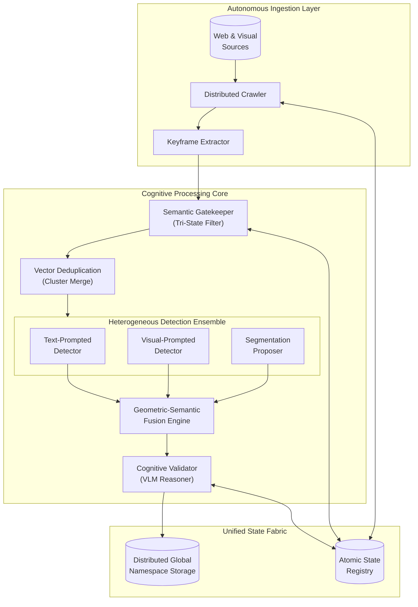
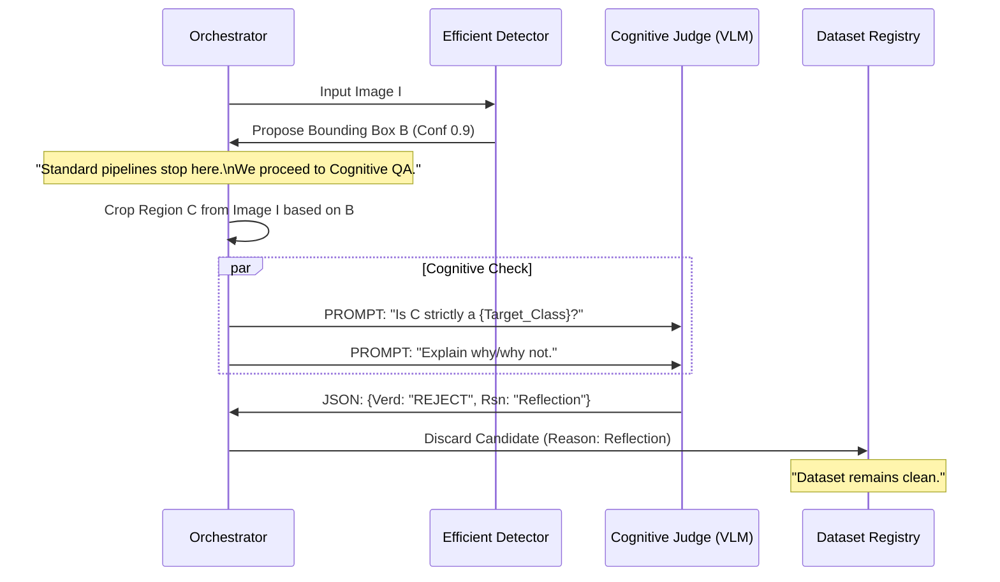

---

tags:

  - IDF

  - Patent

  - AI

  - ComputerVision

aliases:

  - Cognitive Visual Mining IDF

cssclasses:

  - wide-page

---

# Invention Disclosure Form

  

## Johnson Controls Inc

  

> [!abstract] Submission Details

> **IDF Number**: IDF-XXXXX

> **Submitted by**: Venkata Pavan Muppala, Rajkiran Gottumukkal

> **Submission Date**: February 5, 2026

> **Countries of Origination**: India

  

## Title

**Method and System for Autonomous Large-Scale Visual Data Mining and Annotation with Cognitive Semantic Validation and Ensemble Fusion**

  

## 1. Problem Statement

> [!failure] The "Data Curation Gap" in AI Development

> The development of robust computer vision systems is currently bottlenecked by the availability of high-quality, diverse, and annotated datasets. Current methods suffer from fundamental limitations:

1. **Blind Data Ingestion**: Traditional web crawlers and scraping tools operate on metadata (text keywords) rather than visual content. This leads to the collection of massive amounts of irrelevant, redundant, or low-quality visual data that pollutes downstream training pipelines.

2. **The "Semantic Gap" in Automated Annotation**: Automated labeling systems (auto-labelers) typically rely on single-model inference, which propagates specific model biases and fails to understand context. They lack the "reasoning" capability to distinguish between a *technically* correct detection (e.g., a rectangular shape) and a *semantically* correct object (e.g., a functional door vs. a reflection).

3. **Redundancy at Scale**: In large-scale scraping, the same visual content appears repeatedly across different sources, times, and formats. Existing deduplication methods (MD5/SHA hashes) cannot detect visual duplicates that have been resized, re-encoded, or slightly cropped, leading to storage bloat and model overfitting.

4. **Orchestration Inefficiency**: Desktop-based scraping tools cannot scale to industrial throughput, while generic cloud scrapers lack the specialized pipeline logic required for frame-level video analysis and state management.

  

## 2. Invention Summary

> [!success] The Solution

> The invention provides an **Autonomous Cognitive Visual Mining Engine** that transforms the internet's unstructured visual data into high-precision, training-ready datasets with very minimal human intervention.

  

**Key Innovations:**

1. **Tri-State Semantic Filtration Method**: A granular filtering logic that maps abstract text requirements into a three-part visual acceptance region (Positive Affinity, Negative Repulsion, Confidence Margin). This filters out 99% of irrelevant content at the ingestion source, far exceeding the precision of standard key-value scrapers.

2. **Semantic Vector Deduplication Grid**: A two-stage redundancy elimination system that projects all incoming visual content into a high-dimensional semantic vector space. It identifies and discards "conceptual duplicates" (visually similar but not identical pixels) across the entire distributed corpus.

3. **Geometric-Semantic Ensemble Fusion**: A method for combining detections from utilizing fundamentally different architectures (e.g., segmentation models, text-prompted models, and standard object detectors) using a size-aware and containment-aware fusion algorithm. This captures edge cases that single models miss.

4. **Cognitive Annotation Validation ("AI-Check-AI")**: A novel quality control mechanism where a "Reasoning Model" (Vision-Language Model) acts as an independent judge to critique the output of "Detection Models." This introduces a semantic feedback loop that eliminates false positives based on contextual understanding, not just confidence probabilities.

5. **ACID-Compliant Distributed Orchestration**: A hybrid architecture using Container Orchestration (K3s) for compute scalability and Relational Row-Level Locking (PostgreSQL) for state control. This provides "Centralized Control with Decentralized Execution," ensuring atomic task management without race conditions.

  

## 3. Detailed Technical Description

The system is architected as a decentralized, self-healing pipeline composed of specialized processing nodes.

  

### A. Autonomous Ingestion & Extraction Layer

The first stage involves the high-throughput acquisition of raw data.

* **Adaptive Distributed Crawling**: Workers autonomously fetch data from diverse web adapters (Video Platforms, Image Hosts, Archives) governed by a "Courtesy Rate-Limiter" to prevent IP bans.

* **Intelligent Extraction**: Instead of blind frame sampling, the system utilizes keyframe-aware extraction to pull candidate frames at significant temporal boundaries.

  

### B. The "Cognitive Filter" (Tri-State Semantic Mapping)

Once extracted, data is immediately filtered to remove noise.

* **Method**: Extracted frames are mapped to a visual representation space and evaluated using a **Three-Way Semantic Thresholding** mechanism.

* **Logic**: The system defines a precise acceptance region using:

    1. **Positive Concept Affinity**: How close the image is to the target.

    2. **Negative Concept Repulsion**: How far the image is from confounding objects.

    3. **Confidence Margin**: A mandatory gap requirement.

* **Outcome**: Maps abstract text requirements to concrete visual representations, filtering out >99% of irrelevant content.

  

### C. Semantic Vector Deduplication Grid

To solve the "Redundancy at Scale" problem, surviving frames enter the Deduplication stage.

* **Concept**: A specific "Semantic Uniqueness Check" that ignores pixel-level differences (compression artifacts, resizing) and focuses on content identity.

* **Method**:

    1. **Embedding Projection**: Images are converted to high-dimensional vectors (via DINOv3).

    2. **Approximate Nearest Neighbor (ANN) Search**: The system queries a distributed FAISS index to find existing vectors within a tight similarity radius.

    3. **Cluster Merging**: Transitive duplicates (A is like B, B is like C) are grouped, and only the highest-resolution exemplar is retained.

  

### D. Geometric-Semantic Ensemble Fusion Engine

To achieve "Super-Human" detection recall, the system aggregates predictions from diverse methodologies:

1. **Open-Vocabulary Detections**: Finds objects based on free-form text descriptions.

2. **Visual Prompting Detections**: Finds objects visually similar to reference examples.

3. **Segmentation-Based Proposals**: Identifies objects based on pixel connectivity and shape.

  

These diverse signals are merged using a **Size-Aware Non-Maximum Suppression (NMS)** algorithm that preserves "nested" interactions and scale-variant instances.

  

### E. Cognitive Validation ("VLM-as-Judge")

This is the core "inventive step" for annotation quality.

* **Concept**: Standard detectors output a box and a label but lack understanding.

* **Innovation**: The system crops the detected region and submits it to a Reasoner Model (Large Multimodal Model) with a structured interrogation prompt.

* **Outcome**: A structured "Judgment Record" containing a Verdict (Accept/Reject), Score, and Natural Language Reasoning.

  

### F. Systems Engineering & Distributed State

The architecture relies on three critical infrastructure pillars:

1. **Container Orchestration (K3s)**: Provides elastic scalability for the stateless worker nodes.

2. **State Management (Relational Row-Locking)**: A centralized PostgreSQL registry uses `SELECT ... FOR UPDATE SKIP LOCKED` to turn the database into an ACID-compliant distributed queue, ensuring no race conditions.

3. **Unified Distributed Storage (SeaweedFS)**: Abstracts physical storage across nodes into a single logical "Global Namespace" via FUSE mounting, allowing workers to access any file transparently regardless of physical location.

  

## 4. Novelty and Inventive Claims

> [!important] Claims

> We claim the following specific combinations of methods and systems as novel:

  

1. **Tri-State Semantic Filtration Method**: The novel application of a three-part logic (Positive Affinity, Negative Repulsion, Margin Enforcement) to map abstract text requirements to visual data streams, enabling high-precision sampling from noisy sources.

2. **Distributed Visual Deduplication at Scale**: The architecture of applying approximate nearest neighbor (ANN) search on continuous video frame embeddings to identify and prune redundancy across a distributed ingestion cluster.

3. **Semantic-Geometric Fusion Algorithm**: The specific algorithmic combination of IoU-based spatial filtering with semantic consistency checks to merge predictions from heterogeneous model architectures.

4. **Method of Cognitive Annotation Feedback**: The systematic coupling of a high-speed "Proposer Model" (Detector) with a high-latency, high-intelligence "Judge Model" (VLM) to automate Quality Assurance (QA).

5. **ACID-Compliant Distributed Orchestration**: The specific architecture of using Relational Row-Level Locking to coordinate a massive-scale, containerized (K3s) visual mining cluster, providing "Centralized Control with Decentralized Execution."

  

## 5. Commercial Application & Detectability

**Application**:

This technology serves as a "Data Factory" for Johnson Controls. It autonomously builds proprietary datasets for security, building automation, and retail analytics products, reducing data acquisition costs by orders of magnitude compared to manual labeling services.

  

**Detectability**:

Competitor products utilizing this invention might exhibit:

* Extremely high-quality auto-labels that include "reasoning" metadata.

* API documentation referencing "Consensus Scoring" or "Reasoned Validation" for synthetic data.

* Marketing claims regarding "Self-Healing Datasets" or "Automated Semantic QA."

  

## 6. Technical Architecture Diagrams

### Figure 1: Conceptual System Architecture

  

  

### Figure 2: The "Cognitive Validation" Loop (Novelty Highlight)

  

